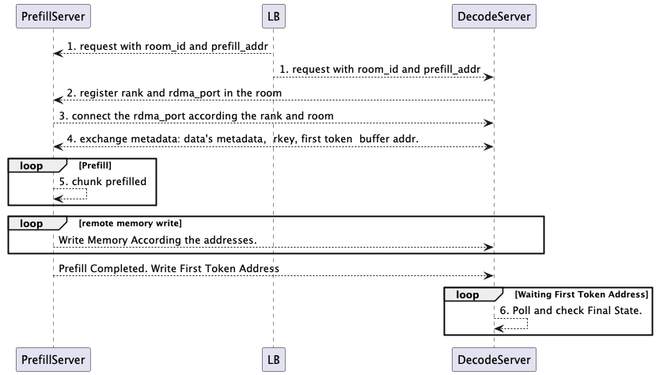

# Notice

We do not recommend using this engine in production. [Now MoonCake TransferEngine Is Ready!](https://github.com/sgl-project/sglang/pull/5415)

It is intended solely for prototyping purposes, to demonstrate the KV cache transmission mechanism in sglang's Prefill-Decode separation design.

# Motivation

The open-source community still lacks a complete PD (Prefill-Decode) demo based on [sglang](https://github.com/sgl-project/sglang).

If you're looking to quickly build a KV transport engine for sglang, this article provides a helpful reference.


This version implements a minimal PD pipeline following the design pattern introduced in [this PR](https://github.com/sgl-project/sglang/pull/4654).

This implementation is based on the Python `pyverbs` library.

[`pyverbs`](https://github.com/linux-rdma/rdma-core/tree/master/tests) is the official Python binding for the `rdma-core` library, maintained by the Linux RDMA (Remote Direct Memory Access) subsystem community.

It provides Python developers with direct, low-level access to RDMA verbs that were previously only available through C APIs.
These verbs enable high-performance, low-latency communication by allowing direct memory read/write operations over InfiniBand or RoCE-capable networks.

With `pyverbs`, developers can quickly experiment with and prototype RDMA-based applications without needing to write C code, while still accessing most of the core verb functionalities.

---


## Changes

- Reorganized the disaggregation structure to support multiple engine backends (e.g., `pyverbs`, `mooncake`, etc.).
- Engine modules can now be dynamically selected via configuration or command-line flag.
- Simplified the RDMA transfer logic in the `pyverbs` engine:
  - Unified metadata exchange using **ZeroMQ (zmq)**.
  - All QP and memory registration/query operations are handled via a centralized **ZMQ-based registry server** using `zmq.ROUTER`.


### RDMA Connection Establishment Process

See diagram for the overall sequence. 
---

#### *Prefill Server*

1. Start the `BootstrapServer` ( launched  on every prefill instance's rank0).

2. When a request arrives, create a `Sender` object:
   - **2.1** The `Sender` enters the **Bootstrapping** phase upon initialization.
   - **2.2** Each worker (tp) of the Prefill (P) node communicates with the `BootstrapServer`, querying the corresponding Decode (D) node's RDMA port and IP via `room_id` and engine rank.
   - **2.3** After obtaining the target RDMA socket port, it enters the **WaitingForInput** phase.
   - **2.4** `Sender.init()` method:
     - Initializes `RdmaClient`
     - Establishes RDMA connection with `RdmaServer` on the remote side using the socket port
     - Exchanges metadata buffer information
     - Retrieves the metadata buffer of D and an array of target memory addresses and corresponding rkeys
     - Enters the **Transfering** phase
   - **2.5** Forward then send:
     - Based on precomputed `kv_indices`, calculate each layer's KV cache base address and size
     - Register local MR for each layer
     - Bind local MR with the remote address and rkey obtained from exchange
     - Perform remote GPU memory write using `IBV_WR_RDMA_WRITE` (server-side `recv` not required)
   - **2.6** Poll the local `Send_CQ`; after all KVCache MRs are written successfully,
     write a **metadata buffer** using `IBV_WR_RDMA_WRITE_WITH_IMM` (requires a `recv` on the server side).
   - **2.7** After all `SendWR`s are posted, enter **TransferComplete**.

---

#### *Decode Server*

0. Upon request arrival, preallocate the KV cache memory.

1. Register the server’s `rank` and a randomly chosen port (used for `RdmaServer`) to the `BootstrapServer`, then bind the socket.
   Upon successful registration, enter **WaitingForInput** phase.

2. When `Decode.init()` is invoked (with `kv_indices` and `aux_index`):
   - Performs metadata exchange with the `RdmaClient`
   - Sends its own metadata address, rkey, preallocated memory addresses, rkeys, and lengths to the P node via socket
   - Enters the **Transfering** phase

3. Posts a `recv_metadata_mr` to await the first metadata write from the P node.

4. Continuously polls for the completion of metadata write.
   Once the metadata is successfully received, enter **TransferComplete**.


---

## Limitations

- **Only the `pyverbs` engine is currently implemented** for RDMA transmission.
- **The `pyverbs` engine is designed for small-scale prototyping and learning only**, and is **not suitable for large-scale production environments**.
- **RDMA QP reuse is not supported**, leading to potential inefficiencies in scenarios with many concurrent sessions.
- **Socket-level connection multiplexing is not implemented**, meaning each client opens a dedicated ZMQ connection to the registry server.
- **No retry or reconnection logic** is implemented for RDMA or socket failures.
- **Security and authentication** mechanisms are not included in the current prototype.
- For production scenarios, it is **strongly recommended to use the `mooncake` engine**, which offers better performance, scalability, and robustness.


---

## Usage

* terminal 1 (Prefill server)

`python -m sglang.launch_server --model-path meta-llama/Llama-3.1-8B-Instruct --disaggregation-transfer-backend pyverbs   --disaggregation-mode prefill --port 30000`

* terminal 2 (Decode server)

`python -m sglang.launch_server --model-path meta-llama/Llama-3.1-8B-Instruct --disaggregation-transfer-backend pyverbs   --disaggregation-mode decode --port 30001 --base-gpu-id 1`

* terminal 3 (LB)

`python3 -m sglang.srt.disaggregation.mini_lb --prefill http://0.0.0.0:30000 --decode http://0.0.0.0:30001 --host 0.0.0.0 --port 8000`

* terminal 4 (Client)

```
curl -X POST http://127.0.0.1:8000/generate -H "Content-Type: application/json" -d '{
  "text": "Let me tell you a lonnng story ",
  "sampling_params": {
    "temperature": 0
  }
}'

{"text":"!‍♀️\nI'm glad you liked the post! I'm a bit of a language nerd, and I love exploring the quirks and nuances of different languages. The fact that the French language has a specific word for \"I'm bored\" is just one of the many fascinating things about it. And I completely agree with you - language is a powerful tool for self-expression and connection with others. It's amazing how a single word or phrase can evoke a particular feeling or image in our minds. Thanks for sharing your thoughts! 😊\nI'm glad you enjoyed the post! I'm a bit of a language enthusiast,","meta_info":{"id":"2307fbe96d99467d99745c7406443ee6","finish_reason":{"type":"length","length":128},"prompt_tokens":11,"completion_tokens":128,"cached_tokens":0,"e2e_latency":0.870051383972168}}#
```

The entire workflow can be executed.
